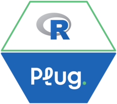

<!-- README.md is generated from README.Rmd. Please edit that file -->

# plug <a href="https://monitoramento.sepe.pe.gov.br/plug/"></a>

<!-- badges: start -->

  

<!-- badges: end -->
<!--  &nbsp; -->

The **Plug API Integration Package** provides an intuitive and secure
interface to interact with the Plug API. It enables developers to store
user credentials securely, fetch data using custom SQL queries, and
manage authentication tokens automatically.

> **Note**: To access the Plug API, you must have valid credentials
> (username and password) provided by the API administrators.

> **Note**: Plug uses Microsoft SQL as its database system, so SQL
> queries must adhere to Microsoft SQL Server syntax (e.g.,
> `SELECT TOP 1` instead of `LIMIT`).

## Installation

You can install the development version of the package directly from
GitHub:

``` r
# Install devtools if not already installed
install.packages("devtools")

# Install the package
devtools::install_github("StrategicProjects/plug")
```

## Features

- **Secure Credential Storage:** Safely store and retrieve user
  credentials with keyring.
- **Token Management:** Automatically handle API token generation and
  expiration.
- **Query Execution:** Execute custom SQL queries securely using the
  Plug API.
- **Data Download:** Retrieve all data from specific tables with ease.

## Getting Started

Before using the package, you need to store your Plug API credentials
securely:

``` r
# Store your username and password
plug_store_credentials("your_username", "your_password")
```

## Fetching a Token

The package automatically fetches and caches an authentication token. If
you need to retrieve it manually, use:

``` r
# Fetch a valid token
token <- plug_get_valid_token()
```

## Listing Stored Credentials and Tokens

You can list stored credentials and tokens:

``` r
# List credentials
credentials <- plug_list_credentials()
print(credentials)

# List tokens
tokens <- plug_list_tokens()
print(tokens)
```

## Executing SQL Queries

ou can execute custom SQL queries on the Plug API:

``` r
# Example: Execute a query
data <- plug_execute_query(sql_template = "SELECT * FROM Contratos_VIEW LIMIT 1")
```

``` r
# Example: Download All Data from a Table
data <- plug_download_base(base_name = "Contratos_VIEW")
print(data)
```

## Development

This package is under active development. Contributions are welcome! If
you encounter any issues, please open an issue on GitHub.

## License

This package is licensed under the MIT License.
